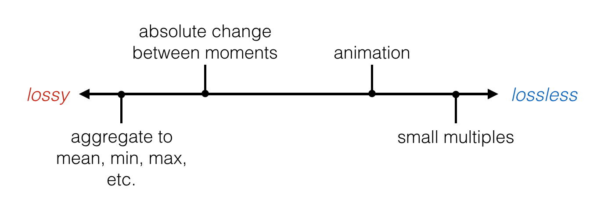
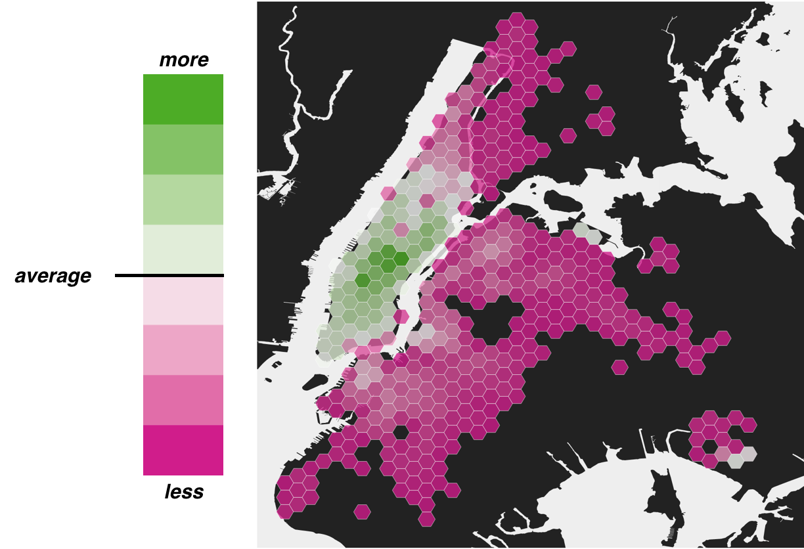
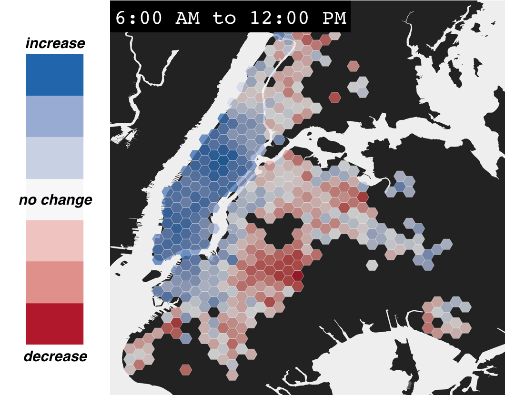
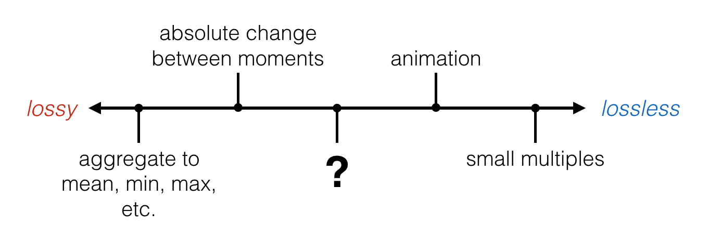
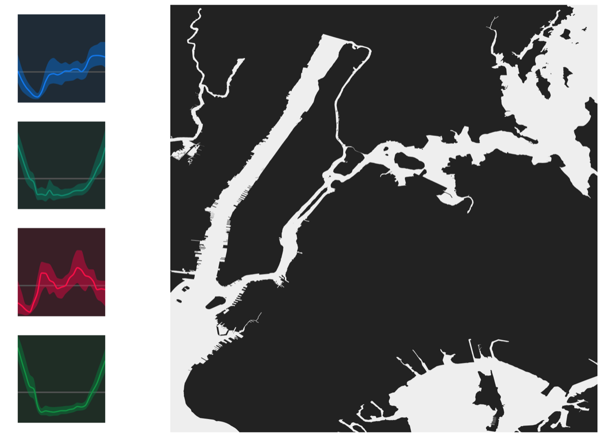
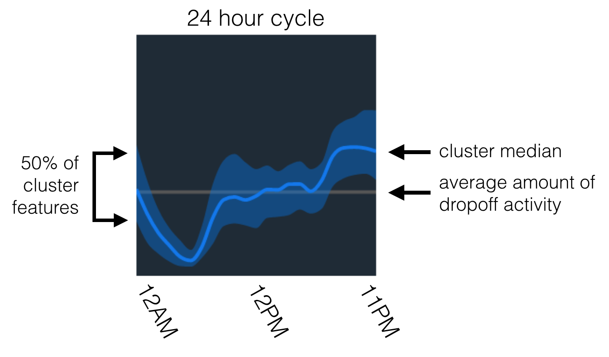
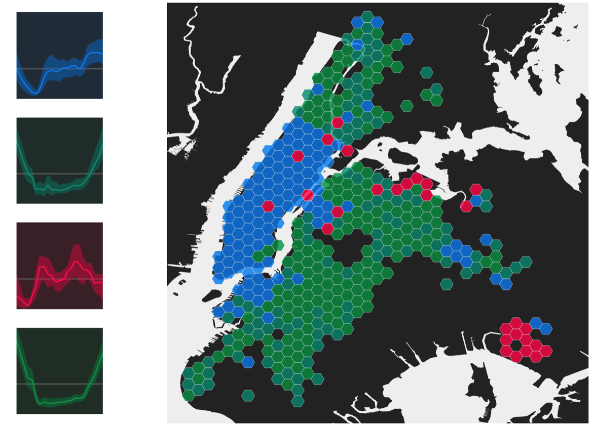
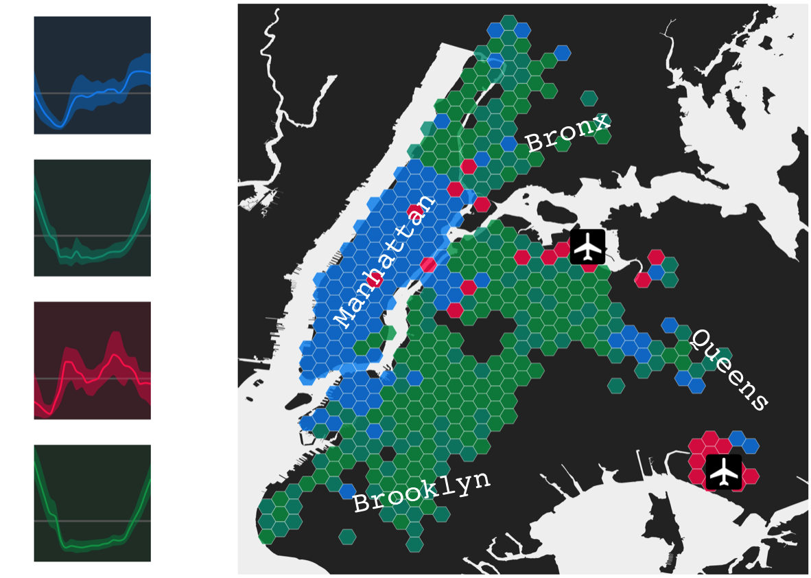
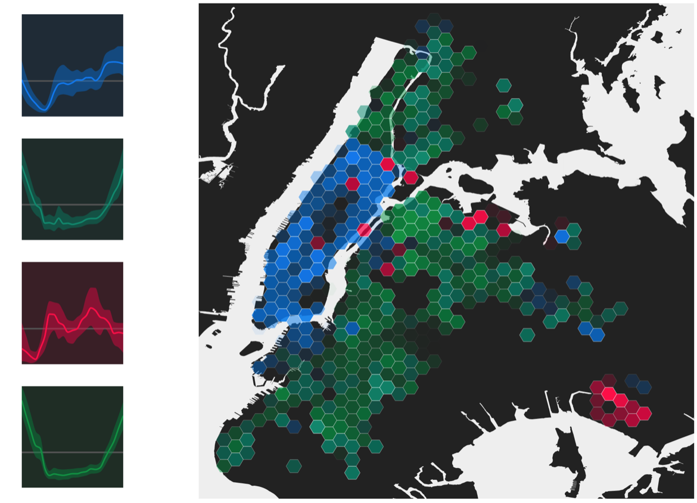
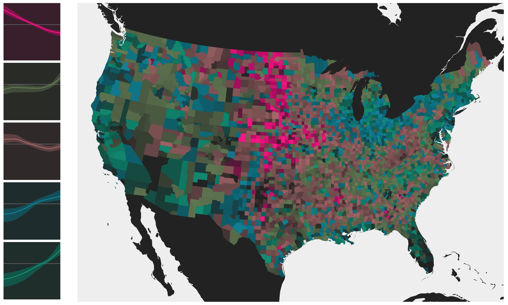

# Beyond Choropleth Animation and Small Multiples: A Cubist Approach to Temporal Data

## Cubism

[Cubism](https://en.wikipedia.org/wiki/Cubism) was a highly abstracted, early 20th century visual art style. Cubist artists rejected the notion that art should aim to perfectly capture nature. Some of the earliest cubist paintings were created by Pablo Picasso.

<figure>

<figcaption>Girl with a Mandolin, Pablo Picasso, 1910</figcaption>
</figure>

Classical notions of perspective were left behind as instead the 2-dimensionality of the canvas was emphasized and embraced. As one Wikipedia contributor writes, "In Cubist artwork, objects are analyzed, broken up and reassembled in an abstracted form —- instead of depicting objects from a single viewpoint, the artist depicts the subject from a multitude of viewpoints to represent the subject in a greater context."

<figure>

<figcaption>Violon (Violin), Pablo Picasso, 1911-12</figcaption>
</figure>

One painting by Marcel Duchamp depicts a human figure walking down a set of stairs and serves effectively as a static representation of change through time. Cubism excels in visually and statically depicting complex objects.

<figure>

<figcaption>Nude Descending a Staircase, Marcel Duchamp, 1912</figcaption>
</figure>

## Geographic Time Series

Another sort of complex objects are geographic time series datasets. These datasets are collections of geographic features where each feature has some sort of value or measurement that changes between moments of time. Let's look at taxi cab drop offs in New York City as an example, where our features will be hexagonal grid cells overlaid on the city with measurements of the number of drop offs that occurred during each hour of the day, from midnight to midnight, over a two year timespan.

<figure>

<figcaption>New York City hexagonal grid for counting taxi cab drop offs</figcaption>
</figure>

The most typical and effective way to show a time series is with a simple line chart. However, line charts quickly turn into jumbled messes of spaghetti when trying to depict hundreds or thousands of individual features. Line charts also fail to provide geographic context when history, environment, demographics, or spatial relationships can be critical to understanding temporal trends in a region or place.

So how can we communicate both temporal and spatial patterns?

Existing methods range on a spectrum of [lossy](https://en.wikipedia.org/wiki/Lossy_compression) to [lossless](https://en.wikipedia.org/wiki/Lossless_compression), meaning they either generalize out much of the data's information or they provide the data in complete detail. Let's examine the strengths and shortcomings of these approaches.

<figure>

<figcaption>Current methods of displaying geographic time series ranging from lossy to lossless.</figcaption>
</figure>

Aggregating measurements to a mean, maximum, minimum, or some other measure over the full range of time is clear and easy to read. However, this method fails to any information about hourly measurements. It's completely lossy.

<figure>

<figcaption>Aggregating to above or below the mean number of dropoffs.</figcaption>
</figure>

Another choice may be to show the absolute change between moments of time. These types of maps are straightforward, but they still miss out on most of the available temporal information. A map depicting change in number of taxi dropoffs between 6:00 AM and 12:00 PM may answer one question, but it leaves complete uncertainty for the other 22 hours of the day. This approach is still super lossy.

<figure>

<figcaption>Showing the change in number of dropoffs between two moments in time.</figcaption>
</figure>

To capture the full range of moments, small multiples are common. These are usually fascinating displays and because they're lossless, small multiples make a great resource for pouring over all the information. However, they are limited by display space and to tease out patterns requires lots of mental and visual work from the reader. There's no guarantee that everyone walks away having seen the same patterns.

<figure>

<figcaption>Showing the number of dropoffs every hour in a small multiple display.</figcaption>
</figure>

The most obvious way to show a geographic time series might be animation, where time is represented in the most literal way possible. This is a lossless approach very similar to small multiples. However, animation places a massive cognitive load on the map reader, forcing them to remember the past, watch for changes, track time, and understand the map symbology all at once. The [invisible gorilla](http://theinvisiblegorilla.com/gorilla_experiment.html) is a good example of how we can be confident in our visual attention, but actually miss the real story. What might we be missing when we watch animated maps?

<figure>

<figcaption>Animation showing the number of dropoffs every hour.</figcaption>
</figure>

Is there another option that falls somewhere between these extremes of straightforward-yet-lossy and lossless-yet-burdensome? Yes.

<figure>

<figcaption>Another option</figcaption>
</figure>

Treating geographic time series as a multi-dimensional dataset where each measurement is a dimension opens the possibility using clustering techniques to tease out major trends. Below are the four major trends from the New York City taxi dropoffs dataset. This approach is making use of the tried-and-true line charts that are useful when depicting a small number of trends, like the four clusters here.

<figure>

<figcaption>Four major trends in taxi cab dropoffs based on multidimensional clustering of the geographic time series.</figcaption>
</figure>

Here, each grid cell feature is assigned to one of four clusters based on normalized rates of between-measurement change. K-means clustering looks at each feature and its hourly measurements and assigns it to a group of features that are most similar. The chart below, an annotated version of the blue trend in the figure above, is representative of the first cluster.

<figure>

<figcaption>The first trend determined by a multidimensional clustering of the time series shows few dropoffs in the early morning, more during the daytime, and most occurring after the work day.</figcaption>
</figure>

The real magic happens when we color grid cells on the map based on what cluster they were assigned to. The spatial correlation is striking.

<figure>

<figcaption>Major trends mapped</figcaption>
</figure>

You may also be noticing that very distinctive red cluster and that two clusters are nearly the same color green. In assigning colors to the clusters, I've reprojected the cluster centroids into a perceptual color space so that similar clusters have similar colors and outlying clusters stand out. In this case, the bright red grid cells correspond directly with the unique traffic dropoff patterns of JFK and LaGuardia Airports, while the similar green cells mix throughout Brooklyn, Queens, the Bronx, and northern Manhattan.

<figure>

<figcaption>Some labels for geographic context</figcaption>
</figure>

And to take things a step further, I'll also adjust the transparency, or alpha or opacity, of each grid cell based on how well it fits into its assigned cluster. Now, the most prominent hexagons are the ones that are most representative of their cluster.

<figure>

<figcaption>Grid cells made more transparent if they were outliers within their assigned cluster</figcaption>
</figure>

## Cubist Maps

Remember those cubist art paintings? They analyzed and reassembled objects in an abstracted form that was complex but insightful at the same time. This major-trends approach for mapping geographic time series draws a close parallel. The simplicity of absolute change maps or realism of map animations is tempting, but we can also look towards the cubist art movement for ideas about how we can create abstracted views on geographic time series that provide a fuller context than conventional methods.

Here's major trends in United States population between 1950 and 2010:

<figure>

<figcaption>Major trends in United States population from 1950 to 2010. Source: [NHGIS](https://www.nhgis.org/)</figcaption>
</figure>

### Notes

- Checkout the JavaScript library on GitHub: https://github.com/aaronpdennis/geo-time-series
- Ping me with your questions and thoughts: [@aaronpdennis](https://twitter.com/aaronpdennis)
- This is a recap of my talk from [NACIS 2016](http://nacis.org/)

### Further Reading

[Jonathan Schroeder's urban core trend maps](http://users.pop.umn.edu/~jps/core_trends/)
