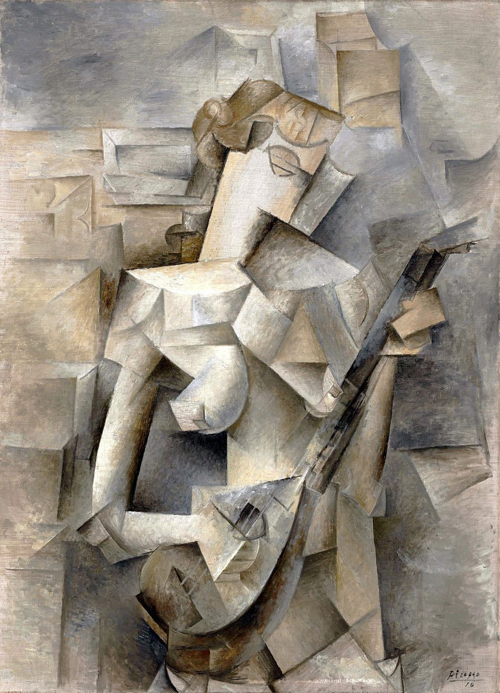
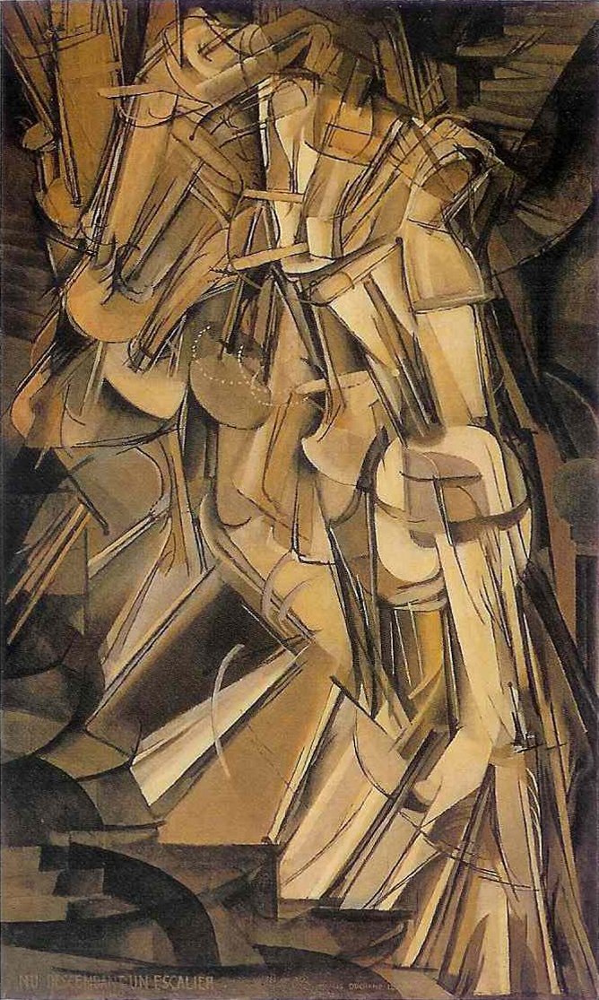
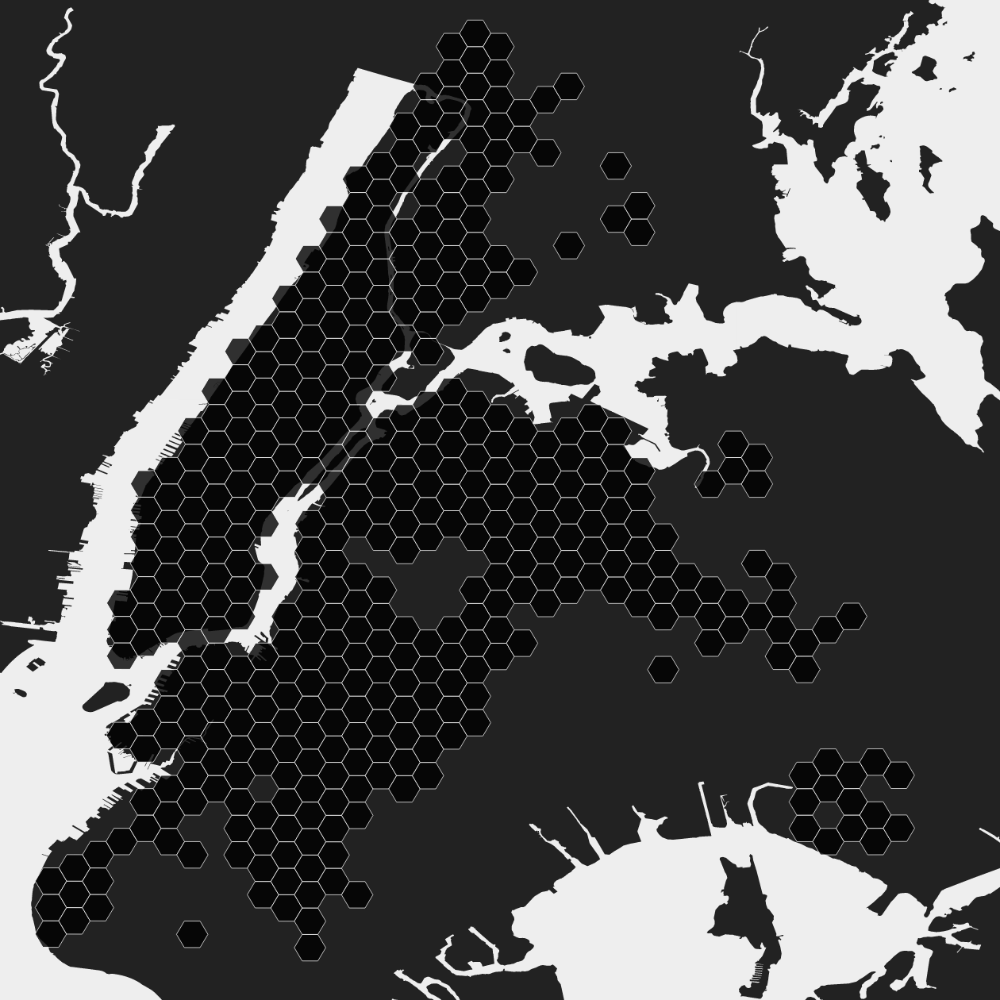

# Beyond Choropleth Animation and Small Multiples: A Cubist Approach to Temporal Data

## Cubism

[Cubism](https://en.wikipedia.org/wiki/Cubism) was a highly abstracted, early 20th century visual art style. Some of the earliest cubist paintings were created by Pablo Picasso.

Cubist artists rejected the notion that art should aim to perfectly capture nature. Classical notions of perspective were left behind as instead the 2-dimensionality of the canvas was emphasized and embraced. As one Wikipedia contributor writes, "In Cubist artwork, objects are analyzed, broken up and reassembled in an abstracted form —- instead of depicting objects from a single viewpoint, the artist depicts the subject from a multitude of viewpoints to represent the subject in a greater context."

One painting by Marcel Duchamp depicts a human figure walking down a set of stairs and serves effectively as a static representation of change through time. Cubism excels in visually and statically depicting complex objects.

## Geographic Time Series

Another sort of complex objects are geographic time series datasets. These datasets are collections of geographic features where each feature has some sort of value or measurement that changes between moments of time. Let's look at taxi cab drop offs in New York City as an example, where our features will be hexagonal grid cells overlaid on the city with measurements of the number of drop offs that occurred during each hour of the day, from midnight to midnight, over a two year timespan.

The most typical and effective way to show a time series is with a simple line chart. However, line charts quickly turn into jumbled messes of spaghetti when trying to depict hundreds or thousands of individual features. Line charts also fail to provide geographic context when sometimes history, environment, demographics, or spatial relationships are critical to understanding temporal trends in a region or place.

### Prior Art

[Jonathan Schroeder's urban core trend maps](users.pop.umn.edu/~jps/core_trends/)
